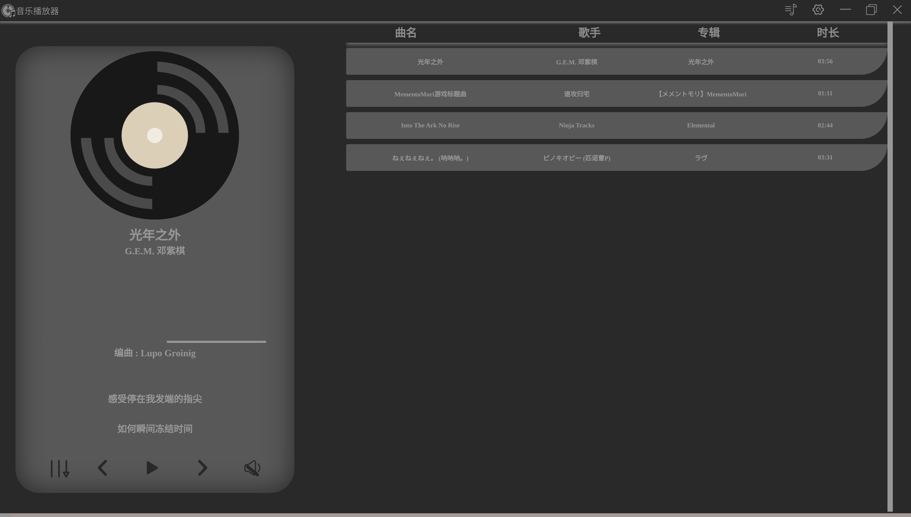
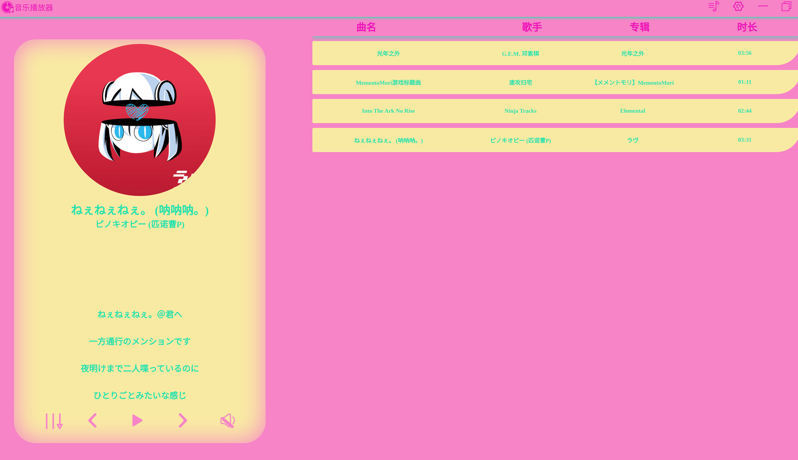
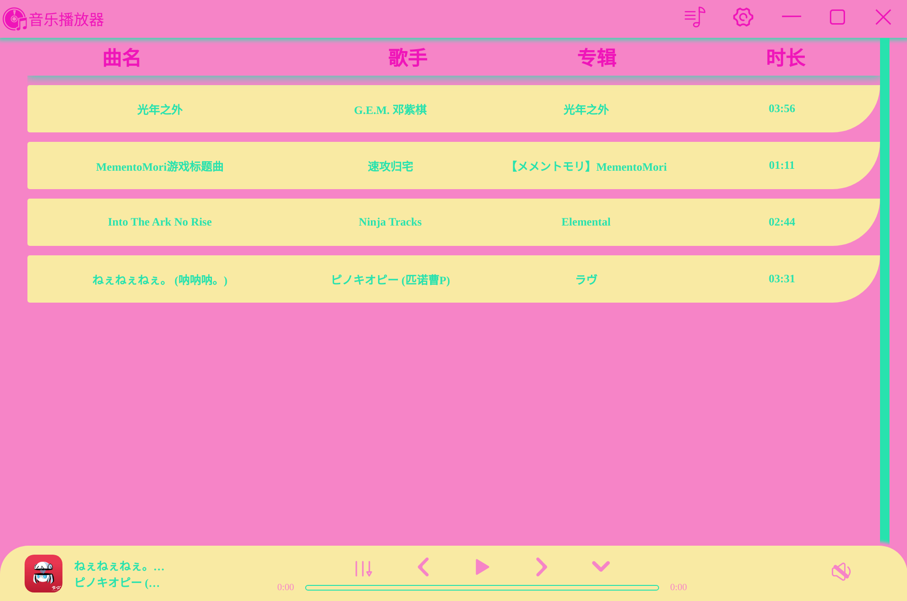
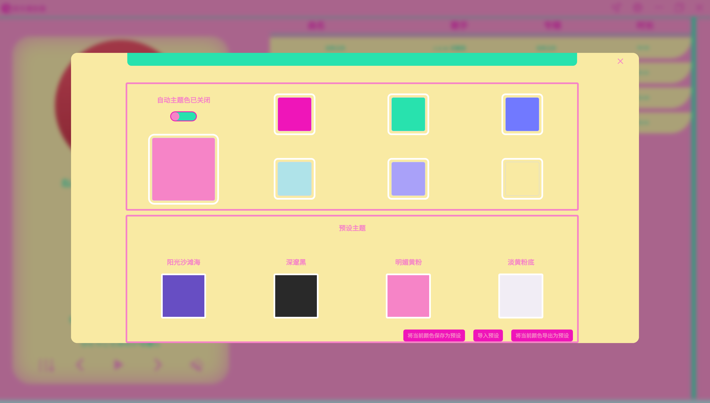

# musicplayer

# 该项目是一个跨平台的音乐播放器

**首先,如果您是linux用户或mac用户,请先自行安装Ffmpeg,当然了也可以在软件的设置中制定Ffmpeg二进制文件的路径
默认会使用系统中的Ffmpeg,除了`mp3,ogg,acc,wav,flac`这些格式的音乐外,其他格式的音乐都会经过转码后再播放,所以请确保您正确的安装或选择了Ffmpeg**

**ubuntu**

```bash
sudo apt-get install ffmpeg
```

# 还未制作完成,正在制作中

# 启动项目

```bash
# 先从git上克隆仓库
git clone https://github.com/jxsm/musicplayer.git
# 进入项目
cd musicplayer
# 下载依赖
npm install
# 启动项目
npm run electron:serve


```

# 构建项目

```
# 先从git上克隆仓库
git clone https://github.com/jxsm/musicplayer.git
# 进入项目
cd musicplayer
# 下载依赖
npm install
# 设置环境变量
   # linux || mac
export NODE_OPTIONS=--openssl-legacy-provider
   # windows
set NODE_OPTIONS=--openssl-legacy-provider

# 构建
npm run electron:build


```

# 预览








